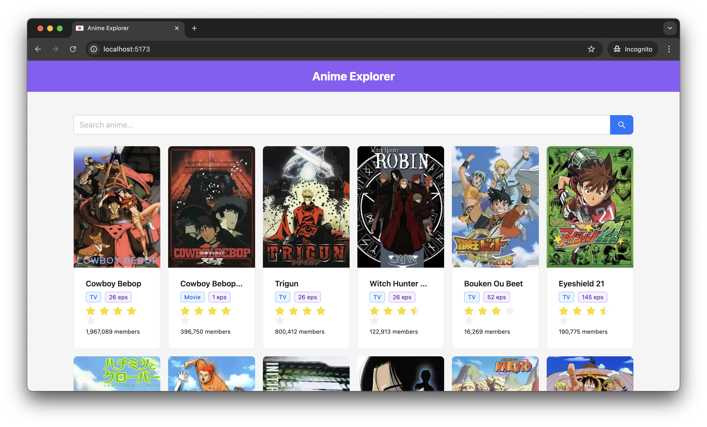
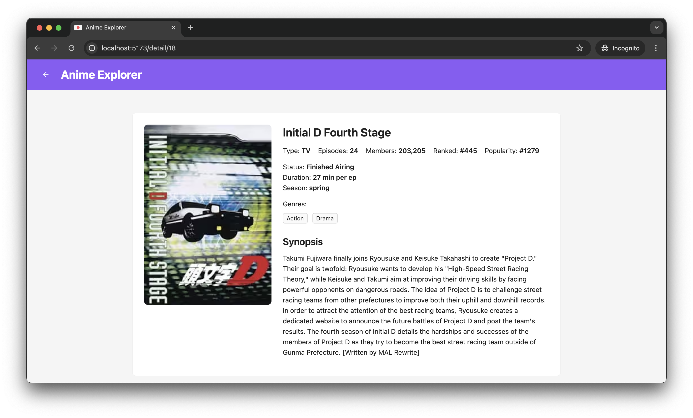

# Anime Explorer 🎌

**Anime Explorer** is a modern and responsive web application for searching and exploring anime, powered by the [Jikan API](https://docs.api.jikan.moe/). Built with React, Vite, TypeScript, and Ant Design.

## ✨ Features

- 🔍 Search for anime by title
- 🎴 Browse anime in a clean card-based layout
- 📄 View detailed information: rating, episodes, type, status, genres, and more
- 🎞️ Watch trailers directly (when available)
- 📱 Fully responsive design for mobile and desktop
- 🔙 Back navigation support for detail pages

## 🚀 Tech Stack

- [React](https://react.dev/)
- [Vite](https://vitejs.dev/)
- [TypeScript](https://www.typescriptlang.org/)
- [React Router](https://reactrouter.com/)
- [Ant Design](https://ant.design/)
- [Jikan REST API](https://docs.api.jikan.moe/)

## 📦 Getting Started

### Using **npm**

```bash
# 1. Clone the repository
git clone https://github.com/your-username/anime-explorer.git
cd anime-explorer

# 2. Install dependencies
npm install

# 3. Start development server
npm run dev
````

### Using **Yarn**

```bash
# 1. Clone the repository
git clone https://github.com/your-username/anime-explorer.git
cd anime-explorer

# 2. Install dependencies
yarn

# 3. Start development server
yarn dev
```

Then, open your browser and go to `http://localhost:5173`.

## 🗂️ Project Structure

```
src/
├── components/         # Reusable UI components
├── hooks/              # Custom React hooks
├── pages/              # Page components (Home, Detail)
├── types/              # TypeScript type definitions
├── constants/          # Constants like API URLs
└── App.tsx             # Main application entry point
```

## 🔧 Notes

* This project uses `@` as an alias to the `src/` directory for cleaner imports. Make sure both `vite.config.ts` and `tsconfig.json` are configured properly.
* All anime data is fetched from the [Jikan API](https://docs.api.jikan.moe/). Be mindful of their rate limits and usage policies.

## 📸 Screenshots

*(Add your screenshots in a `screenshots/` folder and update the paths below)*



